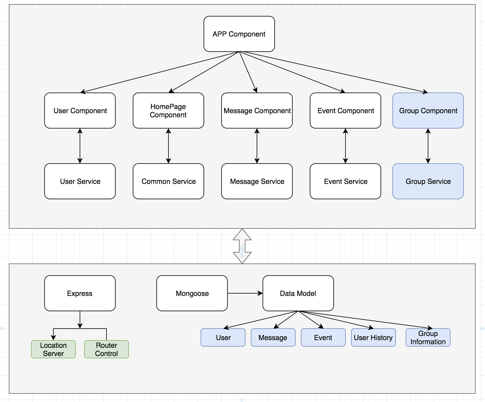

# Modules

According to the original 3Cs discussion, there are several modules in this application such message, event, same trip group and users etc.


# Application Architecture

This application was designed using Angular 6/7 with express middleware in nodeJs. All datas were stored in mongo collections.



There would be five or more Components/Views:

- Home Component

  This component is to display all information includes users, messages, events and groups.

- User Component

  To show all user action histories such as login, logout, join etc user related information. The user's location also will be stored in mongo.

- Message Component

  This component is to show messages that users in this community communicated.
  Generally the message in this view is read only, but it can be updated or deleted by the owner who generate this message. An 'x' will be shown on the right of each message which is created by the owner.

- Event Component

  To show all events that users want to share with others. Same as message component, the event can be removed by the owner.

- Login Component

  Very simple implementation with login/register together. A new user will be generated if this user name doesn't exist in our system, otherwise it will be logged in automatically.

- Group Information Component

  This component provides some actions for user to create, delete, join and quit from the group. All actions will be sent to Event Component and generate an event immediately.

* Common Service

  This service will provide or keep some informaition that could be shared by all components. One of them is the geo location. Just simplely using ipinfo.io to fetch user's current location information.

```
getLocation() {
    return (
      this.http
        .get('https://ipinfo.io/json')
        .pipe(map((response) => response || {}))
        .subscribe((res) => {
          console.log('currecnt location: ', res);
          this.currentLocation = res;
        }),
      (err) => {
        console.log('add user error:', err);
      }
    );
  }
```

# Data Design


There are multiple data models used in this application.

### Event

```
let Event = new Schema(
  {
    content: {
      type: String,
      required: true,
    },
    createdBy: {
      type: String,
    },
    createdOn: {
      type: Date,
      default: Date.now,
    },
    status: {
      type: String,
      enum: ['active', 'removed'],
    },
  },
  {
    collection: 'event',
  },
);
```

### User

```
let User = new Schema(
  {
    username: {
      type: String,
      required: true,
    },
    password: {
      type: String,
      required: true,
    },
    name: {
      type: String,
      default: this.username,
    },
    createdBy: {
      type: String,
      default: 'admin',
    },
    createdOn: {
      type: Date,
      default: Date.now,
    },
    status: {
      type: String,
      enum: ['active', 'inactive'],
      default: 'active',
    },
    lastLogin: {
      type: Date,
      default: Date.now,
    },
  },
  {
    collection: 'user',
  },
);
```

### Message

```
let Message = new Schema(
  {
    message: {
      type: String,
      required: true,
    },
    createdBy: {
      type: String,
    },
    createdOn: {
      type: Date,
      default: Date.now,
    },
    status: {
      type: String,
      enum: ['active', 'removed'],
    },
  },
  {
    collection: 'message',
  },
);
```

### UserHistory

```
let UserHistory = new Schema(
  {
    name: {
      type: String,
      required: true,
    },
    username: {
      type: String,
    },
    event: {
      type: String,
    },
    eventTime: {
      type: Date,
      default: Date.now,
    },
    location: {
      type: Object,
    },
  },
  {
    collection: 'userHistory',
  },
);
```

### Group Information

```
let Group = new Schema(
  {
    name: {
      type: String,
      required: true,
      unique: true,
    },
    description: {
      type: String,
      required: true,
    },
    start: {
      type: String,
      required: true,
    },
    destination: {
      type: String,
      required: true,
    },
    members: {
      type: Array,
    },
    createdBy: {
      type: String,
    },
    createdOn: {
      type: Date,
      default: Date.now,
    },
    status: {
      type: String,
      enum: ['active', 'removed'],
    },
  },
  {
    collection: 'group',
  },
);
```

The relationship between those collections could be like this.


From the ER chart above, we could know that User is the center of all relations. All relations includes UserHistory, Message, Event, GroupTrip and Game are all have many to one relationship with User.

## Web Socket communication between Group and Event


Every time any action that apply to group, it will also add an event data to database. Here are the sequences that happens between group and event.

- User click create, delete, join or quit
- Group Component sends a HTTP request to API server
- API server returns response to Group Component
- Group Component sends an message to Web Socket
- Web Socket broadcasts an message to Event Component
- Event Component receives the message
- Event Component sends a HTTP request to API server
- API server processes the request
- API server sends the response back to Event Component
- Event Component shows event list
