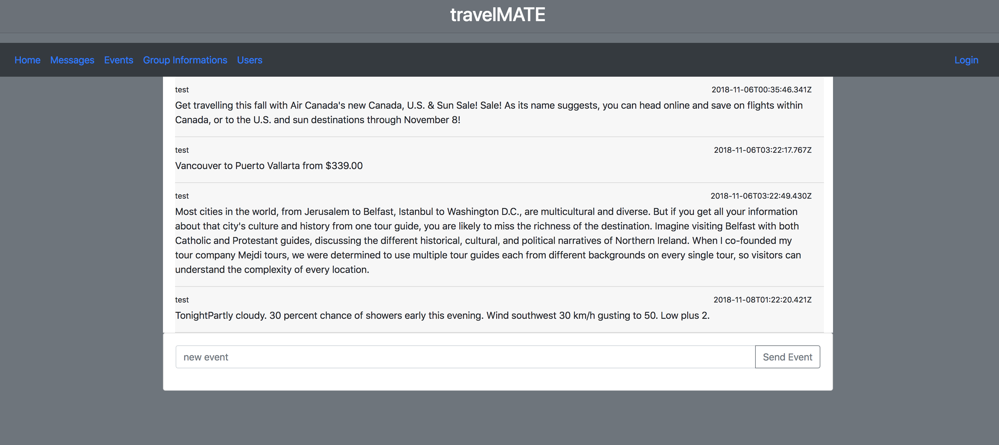

# TravelMate

This project is designed for the people in the community who is travelling or will be on a new trip.

## Install steps

1. git clone from Azure

2. cd CaseStudyApplication-xf18aaa
3. cd travelMate
4. start Angular Client

```
npm install
npm start
```

You should see Angular is starting


Make sure you are using node.js version 11.6.0. If not, you could install or use nvm to run node.js in different version.
Using command `nvm list` to list ann node.js versions installed in your environment. Then use `nvm use v11.6.0` to ensure you are running node.js version 11.6.0.


5. start NodeJs
   go to current folder travelMate

```
cd server
npm install  -- ignore this step if you run front-end first
node server.js
```

You should see node.js server is running


Also make sure your mongoDB is installed and running. If not, please go to [here](https://docs.mongodb.com/manual/tutorial/install-mongodb-on-os-x) to install it and start mongod.

6. Open browser and input URL 'http://localhost:4200'
   You should see the main page of trvelMate
   

## File Structures

### Server


### Client


## Login or Register User

The user login view is very simple. Just click the 'Login' button on the right top.


You also could use register page to register a none-existing user.


Click 'Register' button will show register page.


There are three separate views in Home page. You could get each view by clicking view or through navigating.

### Message View

The message view shows all messages that the users input. The messages could be updated, modified or removed only by the owner.


### Event View

Similar as message view, all events could be deleted by owner.


### User View

Here will show all user actions with current location.


### Group Information

This view provides functionalities for user to create a group which has same travel routine. User also could join to this new group or quit from an existing group.


Create new group:


After user joins or quits the group, an event will be issued and stored in database. The other users could see the difference dynamically.


## Extra information

Run `ng serve` for a dev server. Navigate to `http://localhost:4200/`. The app will automatically reload if you change any of the source files.

## Build

Run `ng build` to build the project. The build artifacts will be stored in the `dist/` directory. Use the `--prod` flag for a production build.

## Running unit tests

Run `ng test` to execute the unit tests via [Karma](https://karma-runner.github.io).

## System Design

To get more design information about this project, you could find from [travelMate System Design](./Design.md).

## Development Processing

You could get all working items (new stories, bugs) from https://dev.azure.com/7wcm0035-xf18aaa-new/CaseStudyApplication-xf18aaa/_workitems/recentlyupdated/
OR
https://dev.azure.com/7wcm0035-xf18aaa-new/CaseStudyApplication-xf18aaa/_workitems/recentlycompleted/


